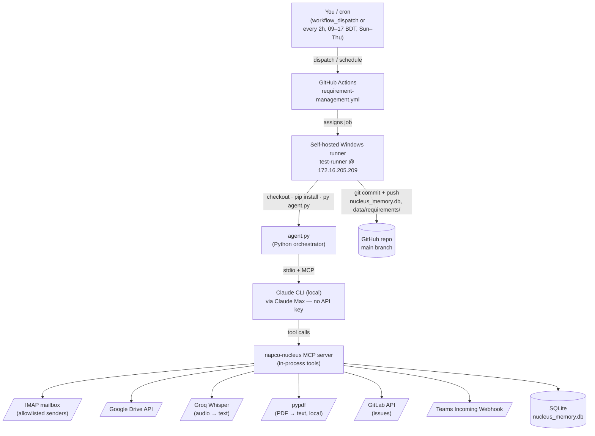
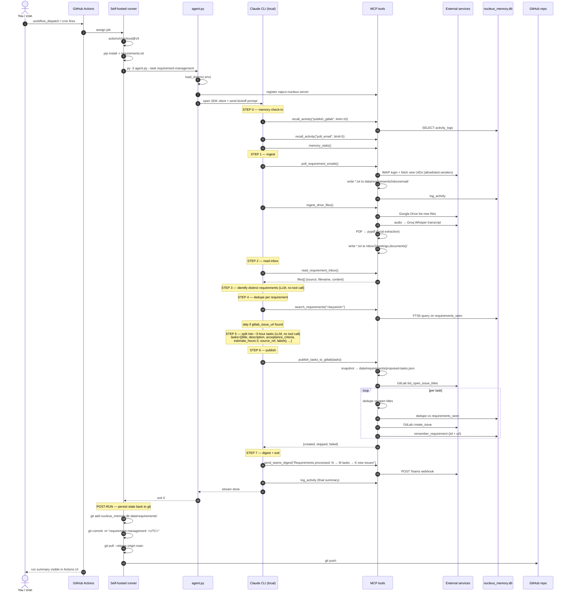

# Requirement Management — End-to-End Flow

How the `requirement-management` workflow turns raw client text (emails, meeting recordings, PDFs, forwarded Teams messages) into ~3-hour tasks tracked as GitLab issues.

> **Note on notifications:** this workflow does **not** send email. Optional notification is a Teams digest via webhook. Emails are produced by the daily-report workflows.

---

## 1. Architecture — who talks to whom

---

## 2. Sequence — one full run, end to end

---

## 3. Who commands whom — cheat-sheet

| Layer | Actor | Command it issues | To whom |
|---|---|---|---|
| 0 | You / cron | `workflow_dispatch` or schedule fire | GitHub Actions |
| 1 | GitHub Actions | "run this job" | Self-hosted Windows runner |
| 2 | Runner shell | `py -3 agent.py --task requirement-management` | Python `agent.py` |
| 3 | `agent.py` | `client.query("Run the Requirement Mgmt loop now…")` | Claude CLI (local, Claude Max) |
| 4 | Claude (the LLM) | tool calls via MCP (`poll_requirement_emails`, `ingest_drive_files`, `read_requirement_inbox`, `search_requirements`, `publish_tasks_to_gitlab`, `send_teams_digest`, `log_activity`) | `napco-nucleus` MCP server (in-process) |
| 5 | MCP tool fns | HTTP / IMAP / SDK calls | IMAP, Google Drive, Groq, GitLab, Teams, SQLite |
| 6 | Runner shell (post-step) | `git commit && git push` | GitHub repo |

**Who does what:** Claude is the *decider* — it reads inbox files, identifies real requirements, splits them into 3-hour tasks, writes the titles and descriptions. The MCP tools are the *hands* — IMAP, Drive, Groq, GitLab, SQLite. GitHub Actions is the *scheduler*. The self-hosted runner is the *machine* the whole thing runs on.

---

## 4. Key guardrails

- **Idempotency:** IMAP uses UIDVALIDITY + since-UID checkpoint; Drive never re-processes a file ID; GitLab dedup runs in two layers (open-issue title match + fuzzy match against `requirements_seen` in memory).
- **Dry-run:** `workflow_dispatch` accepts `dry_run=true`. Tools check `NAPCO_NUCLEUS_DRY_RUN=1` and short-circuit any mutation (no SMTP, no GitLab create, no git push). Memory still logs the dry run.
- **Concurrency:** workflow group `requirement-management` with `cancel-in-progress: false` — runs queue, never overlap.
- **State persistence:** `nucleus_memory.db` and `data/requirements/` get committed back to `main` after every run, so the next run has the previous run's checkpoints and dedupe history.
- **Allowlist:** only IMAP senders in `REQ_SENDER_ALLOWLIST` are ingested. Random inbound mail is dropped.
- **Language:** task titles / descriptions / acceptance criteria are always written in English even when the source is Bangla / Malay / etc.
